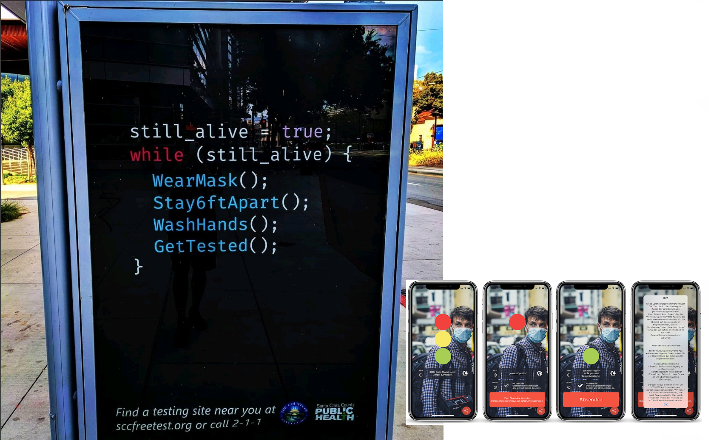
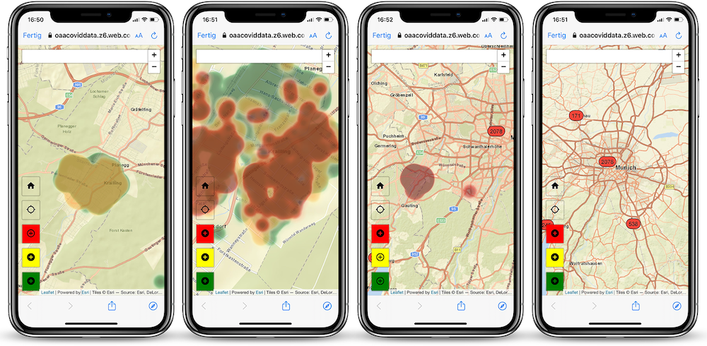

# Variables and Operations

Value assignment is the most elementary concept in programming. In Beatnik, a value is assigned to the individual tokens (in our case, words). Overall, these values can be seen as references. In other words, as signs or variables. Variables, which store information that can be used and/or changed in your  program

<a href="./4literary.html#how-to-code-beatnik">Below</a> in this paper we will see functions that generate lists of words so that they can operate within the Beatnik stacking machine. In all examples we work with the higher programming language [Python](https://www.python.org/), a formal language frequently used in our context for processing natural language texts.
There are many ways to process and generate natural language texts in systems and machines et vice versa.
```{margin}

```

We are standing right in front of the fourth wave of the COVID-19 pandemic, caused by the SARS-CoV-2 Delta variant. For about a year now, our everyday life is more than ever guided by collected data, measured data, metadata, personal data, movement patterns, behaviour patterns, speech and thought patterns & customs, and many other sorts of formalization of ourselves. To some extent even vaccines work algorithmically. Through vaccination we insert pieces of text with code function into our bodies or a certain muscle regions. To do so we implemented ourselves into machines, making ourselves machine readable,  so to speak, and embedded in generalized spaces which can be divided in *syntactic spaces*<sup>[^1]</sup>, *semantic spaces*<sup>[^2]</sup> and in *pragmatic spaces*<sup>[^3]</sup>.

Those pieces of text, representing parts of ourselves, create patterns of meaning inscribed into machine-generated vector spaces. And those spaces increasingly influence our everyday lives. Some of those spaces are epistemological, others can be called cognitive systems. They are abstracted actors changing our perspectives about the material effects of the pandemic, helping us see them in a bigger picture, or a network. They help us see what we cannot see with our biological eyes alone and assist us in navigating  through complex, written, network-like interrelationships such as dataflow graphs, diagrams and heatmaps. Places become datapoints and spaces movement-profiles.

```{margin} _

```
Those little helpers support us right now in this mental performance, in our human ability to abstract concrete things so that we can estimate the consequences for our own actions in the here and now.They enable us to behave responsibly towards our fellow human beings, to be social so to speak. To be allowed to live a life according to our social principles of action: “Act only according to that maxim by which you can at the same time want it to become a general law.” (cf. {cite}`kant_1788`)

In summary, we can say: we write texts into machines and machine-interpreters which help us to see, sometimes through diagrams, sometimes through maps, sometimes through new generated texts, and when we read them and organize our daily life through them, then, exactly through this action we generate together with our little helpers new meaningful words, and ways, and cultural spaces, and also cultural values.

[^1]: The syntax of a language (a system of signs) describes the rules according to which its contructs are formed. The syntax is the study of word formation and sentence structure.
[^2]: The semantics of a language describes the meaning of its constructs, in other words, it’s the doctrine of the words’ meanings and the content meanings of a language.
[^3]: Pragmatics is giving a sense and a meaning to the series of signs into our daily life through action.
----
**References**

```{bibliography}
:filter: docname in docnames

```