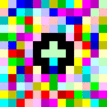

# A code-literary historiography - from Beatnik to Gertrude Stein

## The Beatniks

The term “Beatnik” comes from the name given to the authors of a literal avantgarde movement in the New York literary scene, namely the Beat generation who were also called The Beatniks.

One of the most important works of Beatnik-literature (besides Allen Ginsberg’s »The Howl«{cite}`ginsberg_howl_1956` and William S. Burroughs »Naked Lunch«{cite}`burroughs_naked_2013`, first published in 1959) is Jack Kerouac’s road trip novel »On the Road«{cite}`kerouac_road_2008` first published in 1957. It was Kerouac who introduced the term Beat Generation to the New York literary scene.
```{margin} _

```
In *On the Road*, Kerouac writes about the aforementioned authors and many others, such as the time he spent with Neil Cassady. Kerouac wrote the complete draft of his novel *On the Road* in three weeks in April 1951 in an apartment on West Twentieth Street in Manhattan (cf. {cite}`kerouac_road_2008`). This document was written as one long paragraph on eight long sheets of tracing paper, which he later glued together to form a 120-foot scroll, creating one of the most significant and provocative artifacts in contemporary North-American literary history.
```{margin} _

```
Most Beatnik authors did not really care whether their works referred to canonical concepts of literature. They rejected any form of definition of their activity – they were not worried about being seen as legitimate literature makers or not. Also, they refuted the concept that writing is a clear and fixed function of authors. For them, life and writing can be seen as one, and the focus of their writing and living was the present. Their aim was to create an aesthetics of existence based on a different perception of the present. They used language in an experimental way, inscribing it with a different rhythm, sound, and dynamic; namely the *Beat*.

An endless search for possibilities to fathom the limits of language and to decipher the preconditions of understanding, precisely because the dominant language is the language of the dominant class. That means, an undermining of a dominant-legitimate use of language must be formulated through the use of alternative language techniques.

William S. Burroughs and Brion Gysin, for example, created step-by-step instructions to grammatically scramble the social structure of their time, thus deciphering the prevailing *syntax of control*.
```{margin} _

```
Often the Beatniks were called *those who write in rhythm*. They wrote like they walked and walked like they wrote. Finding the rhythm of the city, the rhythm of the machine. Like Gertrude Stein, they poetically appropriated the language technologies of their time.

Stein was a writer who, beyond question, experimentally discovered spaces in her literature to replace the outdated systems of the 19th century, stepping towards a new understanding of language. Parts of her works in Poetry belongs to an early type of combinatory poetry. We can see those combinatory plays with language especially in works like »Tender Buttons«{cite}`stein_tender_1991`. She used formalized restrictions and self-given constraints to process language, filter it and transform it mainly on a syntactical level into poetry.

We can see this exemplarily in Steins Essay »Poetry & Grammar« in 1935{cite}`gertrude_poetry_1935`, where she wrote: “I like the feeling the everlasting feeling of sentences as they diagram themselves.”

In this literary journey from prose to poetry, she was “*trying to understand (…) to feel inside the words that come out to be outside of you*” and she tried that experiment by using an approach to diagram sentences. So she began to enumerate all those words which do something, because in her eyes, “*as long as anything does something, it stays alive*”. She was doing something close to what nowadays in Computerlinguistics we call POS-Tagging:

```
('they', 'PRP'),
 ('see', 'VBP'),
 ('that', 'IN'),
 ('darker', 'NN'),
 ('makes', 'VBZ'),
 ('it', 'PRP'),
 ('be', 'VB'),
 ('a', 'DT'),
 ('color', 'NN'),
 ('white', 'JJ'),
 ('for', 'IN'),
 ('me', 'PRP'),
```

A grammatical classification.

If we define a text as a combination of elements (characters, words, lemma, interpunctuation, POS, n-gram, etc.), we can count these elements. We see that in first instance in the way of expanding old syntaxes and playing with them as a new grammatical order.

In a way, we can say, that the syntax of our formal technical languages (programming languages and so forth…) went hand-in-hand with early poetic language techniques and experiments. Especially the culture of writing *esolangs* is a very code-poetic way of keeping this spirit alive.

## How to Code Beatnik

"*Beatnik is a very easy language to learn: it has a small command set, a very relaxed syntax, and you can find a reference to the vocabulary in any toy shop,*" says Biffle<sup>[^1]</sup>.

During our dive into Beatnik-Poetry Ting Chun Liu created a [Python](https://github.com/experimental-informatics/hands-on-python) package as well as a Github Repository based on Cliff Biffle’s Beatnik, turning it into functions understandable by writers inexperienced with coding.

Starting with the primary interaction mechanism, the code is progressively modified to meet individual author needs. By getting familiar with the logic of Beatnik’s operation, we can influence the way we write and purpose a new writing system.

But first…:

### Where can i get the Beatnik program?

There are several ways to work with the Beatnik program:

#### 1. Appendix

There are 4 Pages (as Jupyter Notebooks) in the *Appendix* for coding Beatnik (for how to expand and excecute them, please see Chapter <a href="./appendix.html">Appendix</a>):

1. <a href="./execpoem.html">Executable \_ell_ Worl_! Poem</a> < Here you can execute the poem »\_ell_ Worl\_!«, published in July 2021 in the [KURZE Anthology](https://www.khm.de/kurze/)
2. <a href="./Beatnik_interact.html">Beatnik Interactive Coding</a> < You can code Beatnik interactively just out of the box. You will find also a list in there with selected Word Value Data in English and German language.
3. <a href="./Beatnik_step_by_step.html">Beatnik Step by Step</a> < In this Notebook you will find a step by step tutorial for the usage of the Beatnik Library, as explained below in Chapter “Constructing a Beatnik Library”. It includes the aforementioned tokenization, scrabble, and stacking. To see each stacking step, set Debug to True.
4. <a href="./Creating_a_dictionary_of_text.html">Creating a dictionary of text for Beatnik</a> < This Notebook allows you to construct dictionaries that indicate the correspondence between words and their values in real time.

#### 2. Github Repository

##### 2.1. on Binder (browser based)

It is possible to directly run the [Repository](https://github.com/experimental-informatics/beatnik) uploaded to Github in a browser based environment on *Binder* (see: <a href="./appendix.html">Appendix</a>) by clicking the following button: [](https://mybinder.org/v2/gh/experimental-informatics/beatnik/HEAD)

Like working with the pages in the <a href="./appendix.html">Appendix</a>, you do not have to install anything on your machine. 

##### 2.2. run it locally

You can also download the [Beatnik Repository](https://github.com/experimental-informatics/beatnik) from Github via the *Clone or Download*-Button: 


And after that, run it locally on your device.

An easy way to do this is to download and install *Miniconda*. Miniconda is a small, bootstrap version of *Anaconda*, a distribution for programming in *Python* and *R*, especially in scientific computing (data science, machine learning applications, large-scale data processing, predictive analytics, etc.).

*Miniconda* is Free Software and it includes the basic needs for our purposes, like the package manager *conda*, *Python*, the packages they depend on, and only a small number of other useful packages.

You can download it and get the install instructions [»here«](https://docs.conda.io/en/latest/miniconda.html).

#### 3. Python package (local)

As already mentioned, the Beatnik program is also uploaded on Python Package Index (PyPI), a repository of software for the Python programming language: https://pypi.org/project/beatnik/.

Like this, the whole package is all-in-one downloadable with a single line of code and will be immediately implemented in the *Python environment* of your choice.

Therefore, type into your terminal (into your active environment):

```bash
pip install beatnik
```

### Constructing a Beatnik Library

It is important to see the programming language Beatnik not as a simple text translation, but as an interface that breaks down the original text into digits - in this case integers - and then uses those digits to generate text again.

In Beatnik, words have a different meaning than in our everyday use of words. The program will articulate them to reveal the inner structure of its technical environment. In Beatnik, *words* mean actions that are performed. The actions are linked to words by means of letter values, i.e. free from the actual meaning of the words (For example: “Kunstwerk” has the same meaning as “Berechenbar”). In certain instances, they will reveal in their use the close connection between the signs in the machines and all the abstract intermediate levels that lie between the words and our thinking.

In order to compile a dictionary, an adequate corpus of texts is required. In its quality as well as in its quantity. This short sample text is used as a model to show step by step how to convert text into a practical reference for the use of Beatnik. Therefore, we put the string `loud exhibition sometime tells photograph to print only realities` into the variable `text`:

```
text  = '''loud exhibition sometime tells photograph to print only realities'''
```

Constructing the Beatnik library consists of three key steps: **Tokenization**, **Scrabble**, and **Stacking**. Each step has its necessity: *tokenization* converts text to data, *scrabble* transforms data to value, and finally, the value is output as a character based on the [ASCII table](https://exmediawiki.khm.de/exmediawiki/index.php/ASCII-Tabelle) through *stack* machine.

#### 1. Tokenization

The machine processing of text corpora has always required a preparatory phase. In other words, the cleaning up of inconsistencies in the respective use of language, of contexts of meaning, a goal-oriented formalization, and so on. 

The necessary steps that are taken in order to make the respective text machine readable are referred to as text preprocessing in general and tokenization in particular. The further this process of making human-made texts machine readable progresses, the less "human readable" they become.

In the first step, we need to program the *tokenization process*. Therefore, we take an article and we remove all special or functional characters, such as line breaks and tab stops, all numbers and punctuation.

Each word is then stored in a list of single characters. It is worth mentioning that the computer understands it as a list of words as *string* (a data type for plain text), rather than a single text.

```python
#replacing contracted form
text = text.replace("'s"," is").replace("'ll"," will")

#replcaing line breaks and tab
text = text.replace('\n',' ').replace('\t',' ').replace('“', ' " ').replace('”', ' " ')

#removing numbers and punctuations
remove_digits = str.maketrans('', '','"0123456789.-,!?)(-')
text = text.translate(remove_digits)

#split the text into list of words
corpus = text.split(' ')

#remove null element
corpus = [x for x in corpus if x]
```

#### 2. Scrabble

Scrabbling is the process of mapping tokenized characters into numbers. Based on the original design of the scrabble table by James Brunot (1938), we assign a value to each character, and all values of each word are summed up.

```
Scrabble 		Character 		Values

--- ABCDEFGHIJKLMNOPQRSTUVWXYZ ---
1:  A   E   I  L NO  RSTU
2:     D  G
3:   BC         M  P
4:       F H             VW Y
5:            K
6:
7:
8:          J             X
9:
10:                 Q        Z
--- ABCDEFGHIJKLMNOPQRSTUVWXYZ ---
```


A Beatnik program consists of any sequence of English (or German) words; each word is assigned a numerical score (value) that it would receive in a Scrabble game.

The value of the Scrabble score determines which function is performed.

For example the word `l` `o` `u` `d` is mapped to the values of `1` `1` `1` `2` respectively.

After adding them up, we get the value ```5```. In the subsequent action, we will know that the function corresponding to ```5``` is `PUSH`.

Functions in Beatnik include pushing the score of the next word onto the stack (see chapter 3.), testing the stack and jumping forward or backward in the program, as well as other stack operations.

#### 3. Stack machine

A *stack* is a data structure in computer science, that stores elements in a specific way for later use. There are two main operations for stack usage, `PUSH` and `POP`.
```{margin} _

```

`PUSH` adds an element (in our Beatnik case, a number) on top of the stack.

`POP` takes out the top element of the stack.

Here is an example of how the stack machine in Beatnik executes a scrabbled example sentence.

```python
token = ['loud','exhibition','sometime','tells','photograph','to','print','only','realities']
value = [5,22,12,5,21,2,7,7,9] #scrabbled
```

After getting a list of values, we can execute the stack machine.

Based on the word `loud`, the first value in the array (storage) is `1` + `1` + `1` + `2` = `5`, which corresponds to the function `PUSH`.

The list of functions working in the stack machine (+ description of the respective meanings) is as followed:


The code of the `PUSH` function is as following:

```
def PUSH(stack,VALUE,index):
    index += 1    
    # exception for ArrayIndexOutOfBoundary
    if(index < len(VALUE)):
        stack.append(VALUE[index] % 256)
    return index
```

To view the code of all functions, check the Github page for Beatnik functions here: https://github.com/experimental-informatics/beatnik/blob/master/beatnik/beatnik_functions.py


### Beatnik Programming


Above you can see a visualization of how a Beatnik Program works.

To traverse the string `loud exhibition sometime tells photograph to print only realities`, we start by initializing the index to 0, which indicates the first number `5`, which corresponds to the function `PUSH` as we have seen above, in the stack. 

We move to the next element in the list by increasing the index by 1, based on the word `exhibition` , the value accordingly is **22**. After inserting it, we now have `[22]` on the stack.

The next value **12** indicates the action `Duplicate`: the first element of the stack is popped out, and inserted onto the stack twice. The stack machine we now have contains two elements `[22,22]`

```python
def DUP(stack,VALUE,index):
    # duplicate only when there is at least 1 element
    if(len(stack) >= 1):
        a = stack.pop()
        stack.append(a)
        stack.append(a)
    return index
```

Then we `PUSH` *(Function 5)* the value **21** from `photograph` onto the stack, and ignore the next element **2**, which does nothing. There are two **7** from the words `print`,`only` in the list following. The function corresponding to **7** is `ADD`, which means to insert the sum of the last two elements into the stack machine. Sum of `22 and 21` is `43` , sum of `43 and 22` is `65`.

```python
def ADD(stack,VALUE,index):
    # add only when there are more than two elements
    if(len(stack) >= 2):
        a = stack.pop()
        b = stack.pop()
        stack.append(a+b)
    return index
```

Finally, the value from the word `realities` is **9**, which means `OUTPUT`. We then look for the top element `[65]`, translate it with the [ASCII table](https://exmediawiki.khm.de/exmediawiki/index.php/ASCII-Tabelle), and output it as character ```A```.

```python
def OUTPUT(stack,VALUE,index):    
    output_ = ''    # output only when there are at least 1 element    
    if(len(stack) >= 1):        
        output_ = chr(abs(stack.pop()%256))    
    return index
```

By stacking more text and using functions to add and subtract the sum of values, we can output more characters by matching the obtained values to the [ASCII table](https://exmediawiki.khm.de/exmediawiki/index.php/ASCII-Tabelle).

## Esolangs

Of course, there are many more literary esolangs out there then Beatnik. You can find a huge list of esolangs in the [esoteric programming languages wiki](https://esolangs.org/wiki/Main_Page). In our context Shakespeare Programming Language (SPL), by Karl Hasselström<sup>[^2]</sup>, also stack-based, is one worth mentioning. The code of the infamous [Hello World Program](https://exmediawiki.khm.de/exmediawiki/index.php/Shakespeare_Programming_Language) starts like this in SPL:

```
Romeo, a young man with a remarkable patience.
 Juliet, a likewise young woman of remarkable grace.
 Ophelia, a remarkable woman much in dispute with Hamlet.
 Hamlet, the flatterer of Andersen Insulting A/S.

                     Act I: Hamlet’s insults and flattery.

                     Scene I: The insulting of Romeo.

and so on...
```

The program follows the typical structure of a drama: title, dramatis personae (variable declarations), acts / scenes (instructions). The output function, which is in Beatnik the scrabble-word-value 9 (f.ex. the word *realities*) is in SPL `Open your heart` or `Speak your mind`.

Another stack-based esoteric programming language is *Piet*<sup>[^3]</sup>. A language in which programs look like abstract paintings. It uses 20 colours, of which 18 are related cyclically through a lightness cycle and a hue cycle. A single stack is used for data storage, together with some unusual operations.

In Piet, a Hello World Program coud look like this:  or like this  

And of course, it could it be different again. In 2001 Gerson Kurz, a well known inventor of several esolangs wrote *.Gertrude*<sup>[^4]</sup>

A *Gertrude* program consists of sentences in any natural language. For each sentence, the average length of its words is calculated (rounded off), and then the number of words longer than the average is divided by the number of words shorter than the average. The resulting fractions denote instructions and operands. Sentences that contain ! or ? are ignored.In the same way that in the preparatory phase of writing »_ell_ Worl_!«, where the Codichter*innen Julia Nakotte, Julia Vergazova, Ting Chun Liu, Patricia Falk, Julia Maja Funke, Lisa James, Lukas Ortheil and Tom Tautorus took works from Charles Bukowski, Georges Perec, Walter Benjamin, and Herman Melville (amongst others), Gerson Kurz took »Tender Buttons« by Stein and Kants “Critique of Pure Reason” as a base to write a [Hello World](https://exmediawiki.khm.de/exmediawiki/index.php/.Gertrude) Program in a different syntactical order.

The version of *Hello World* in *.Gertrude* which came out from it can be read as follows (the first 16 lines from 270):

```
Winged to be winged means that white is yellow and pieces pieces that are
brown are dust color if dust is washed off then it is choice that is to say
it is fitting cigarettes sooner than paper.
A CARAFE THAT IS A BLIND GLASS.
Suppose they are put together suppose that there is an interruption
supposing that beginning again they are not changed as to position suppose
all this and suppose that any five two of whom are not separating suppose
that the five are not consumed.
Cut more than any other and show it.
He would have been peculiarly well fitted to give a truly scientific
character to metaphysical studies had it occurred to him to prepare the
field by a criticism of the organum that is of pure reason itself.
The difference is spreading.
A sight a whole sight and a little groan grinding makes a trimming such a
sweet singing trimming and a red thing not a round thing but a white thing a
red thing and a white thing.
```

## Intermezzo: Beatnik as a Live Coding Language

What might live coding look like in relation to poetry? The practice of live coding is known from the fields of sound and video, which is almost its sole use. Typically, functions are written to create media in real time and to modulate media over time: changing frequency, velocity, transformations of objects or colour values, etc., often in iterations of a loop (a beat). Sound and image become analog again after synthesis, while text (which was digital before computers) remains digital. While a pitch or colour value may change in steps imperceptible to us, quasi-analog, in text there is a jump - to the next character or string. (See »Tippfehler« (typos) in {cite}`barthes_uber_2019`, 114 f.) In this sense, text is more digital than sound and image. Of course, this is not an obstacle to live coding poetry, it just makes it harder. Since in live coding it is usually not only the result but also the code that is of interest (and presented to the audience), one possibility in relation to text could be to interpret natural language as code – as is executed in the esoteric programming language Beatnik. As Beatnik is inspired by the Beat Generation, which focused on the present time, it seems to fit very well to performing practice, which happens in present time. The following are considerations for why Beatnik is suitable for live coding (even if, or perhaps because, it is challenging).

Live coding is a performance practice. In the performing arts, there are traditional notions (albeit temporary) of good performative quality. This is especially true in music. Quality is achieved by practicing and thus “mastering” an instrument. Even though this is only one and not necessarily the decisive category in the evaluation of a performance as such, it will be explored further here. In concrete terms, this means: How can the (technical) quality of the performer be measured in live coding with Beatnik?

The first level is the code in a human interpretation. One of many possibilities to generate a l is the number sequence ```5``` ```22``` ```5``` ```5``` ```7``` ```12``` ```12``` ```7``` ```7``` ```7``` ```9```, which we get for example by the code

``` python
eH rzauHaods fo ew gonstr lfolow ertabica akslw by wont uyg alpce
```

but also through the code

``` python
eH rauosadHz of we ngtors flwloo ieratcab lkasw yb ntow ygu clpea
```

or through

``` python
He Hazardous of we strong follow bacteria walks by town guy place
```

like Julia Vergazova has done in coding the letter ```l``` for »\_ell_ Worl_!«.

Since in Beatnik’s interpretation of the code only the sum of the values of the characters of a word is relevant and not their order, in terms of the operations triggered the three codes above are the same for the machine interpreter. In human interpretation, they are not. While the first two seem rather arbitrary, the last sequence suggests a non-arbitrary design and encourages us to interpret it rather than the others. Of course, we also expect meaningful text in the output produced by the code, perhaps even text that cannot only be interpreted by us, but is itself (meaningful) Beatnik code again. (Of course, as every text written in the Latin alphabet is Beatnik code, every output produced by Beatnik is a possible input again.)

Another level for measuring quality are the instructions generated by the code. As a reminder, the ASCII value for ```l``` is ```108```, so to generate a ```l```, the value ```108``` must be at the top of the stack and output using the numeric value ```9``` (in the example above by the word/ command “place”). The easiest way is to generate the required number with the simplest possible arithmetic operations (add, duplicate) and then translate this into a desired character via output. Further, more fastidious possibilities exist, such as for example using the stack as data structure, thus storing values purposefully for later use or swapping them. Another challenge is the integration of jumps into the program flow. Thus the quality of a performance shows up on three levels: the program in human-readable form, the operations executed by this code and the output produced. As a further quality the changeability of the program is added: e.g. to produce large differences by the addition or alteration of some characters at the program code, or the opposite, to produce no differences at all at the output. Since the order of the letters within a word is irrelevant, with identical characters different (meaningful) words could be generated, for example “town” and “wont”. But also many different programs could be written from scratch, which all generate the same output. Both are possibilities that run over several iterations of the program, so the Beatnik performance would also follow the scheme of the loop, as is usually the case for live coding with the media of music and images.

From the point of view of the prerequisites of the programming language, Beatnik lends itself to live coding poetry because, on the one hand, it works with natural language on two different levels and, on the other hand, quality characteristics of the code can be derived from the design of the language itself. Suppose we set material or tool mastery as a quality criterion. Beatnik requires parallel thinking at the levels of (1) input, (2) operations effected by it, (3) data in the stack, and (4) output. This is a demanding, purely mental task, so the question is whether it could be done by a machine. It seems so. But Beatnik comes with a kind of a loophole, which makes it difficult for a machine, but instead offers another possibility for the performer: an additional input prompt, which is triggered with the value ```8```. Through this the performer can insert code into the Beatnik interpreter, which is not part of the (more static) regular input code. For e.g., combined with a loop of input prompts (through skip back functions) poetry inside poetry could be written.

We have seen some challenges of the language that make it suitable for live coding performances. But ultimately the challenge of the language is only part of the game; perhaps what is more important is the influence that the specifications of the language and, for example, the restriction to small changes in iterations for the purpose of live performance have on the resulting texts.

>"in programming languages [...] their different structures — semantic descriptors, grammar and style in which algorithms can be expressed — lend themselves not only to different problem sets, but also to different styles of thinking." {cite}`cramer_language_2008`, 170.
>
>

[^1]: URL: http://cliffle.com/esoterica/beatnik/ (Accessed 24.08.2021)

[^2]: URL: http://shakespearelang.sourceforge.net/report/shakespeare/shakespeare.html (Accessed 24.08.2021)

[^3]: URL: https://www.dangermouse.net/esoteric/piet.html (Accessed 24.08.2021)

[^4]: URL: https://exmediawiki.khm.de/exmediawiki/index.php/.Gertrude (Accessed 24.08.2021)

[^5]: URL: http://davidpocknee.ricercata.org/gysin/ (Accessed 24.08.2021)

----
**References**

```{bibliography}
:filter: docname in docnames

```