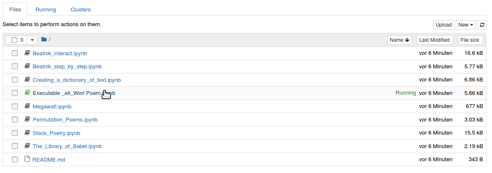
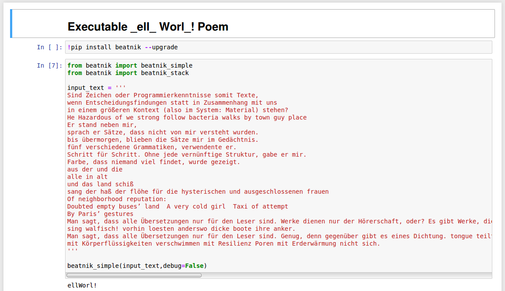

# The rule becomes the author!


»_ell_ Worl_!« is a text by us because we selected and recomposed the text sources. »_ell_ Worl_!« is a text by the authors who wrote the underlying texts. »_ell_ Worl_!« is a text by the Beatnik programmers, because we reassembled the text fragments based on their setup. »_ell_ Worl_!« is a text by Brian Kernighan because he wrote Hello World! for the first time in a programming tutorial. »_ell_ Worl_!« is a text by the students who were assigned the letters H, o and d but did not deliver. »_ell_ Worl_!« is a text.
<center><a href="https://pypi.org/project/beatnik/">Python package</a> @ PyPI &nbsp&nbsp&nbsp&nbsp&nbsp&nbsp&nbsp&nbsp&nbsp&nbsp&nbsp&nbsp&nbsp&nbsp&nbsp&nbspPublished in Anthology <a href="https://www.khm.de/kurze/">»KURZE04«</a>
</center>
<center></center>

This is the code repository to the executable artistic research paper [The rule becomes the author!](https://dev.ground-zero.khm.de/ell-worl-paper/) about the collective Beatnik poem *»\_ell\_ Worl\_!«*, published in July 2021 in the [KURZE04 Anthology](https://www.khm.de/kurze/), and about it’s [Interpreter](https://pypi.org/project/beatnik/), written by Ting Chun Liu. All of the 3 parts were developed and created together at [ground zero](https://ground-zero.khm.de/), in the context of the Seminar [Codichte – Experiments with Cognitive Systems](https://ground-zero.khm.de/?portfolio=seminar-codichte-experiments-with-cognitive-systems), given at the [Academy of Media Arts Cologne](https://en.khm.de/home/) in Winter 2020/21.

“*Executable*” *paper* means, that all the code in the paper was executed to produce this paper and can be executed as well. 

To expand the code and play with it, please click the button below and you will be directed to Binder:<br><br>
[](https://mybinder.org/v2/gh/experimental-informatics/_ell_-Worl_-/HEAD)

## How to code in Binder?

[Binder](https://jupyter.org/binder), like other interactive computing products and services f.ex. [JupyterHub](https://jupyterhub.readthedocs.io/en/latest/), [JupyterLab](https://jupyterlab.readthedocs.io/en/stable/) or [Jupyter Notebook](https://jupyter-notebook.readthedocs.io/en/stable/) and [Jupyter{Book}](https://jupyterbook.org/intro.html) (the tools we have used to write and code this research paper) is part of the [Jupyter Project](https://jupyter.readthedocs.io/en/latest/), a nonprofit organization created to “*develop open-source software, open-standards, and services for interactive computing across different programming languages*” (Python, R, Julia).

*Binder* is meant for interactive and ephemeral interactive coding.

After you have clicked on the Binder-button on the upper right, the virtual environment in which you can code will be loaded into your browser. This will take around 1 minute:


After the environment is ready to use you can go into folder structure:


 and click the page/notebook of your choice:



This will open an editable and executable *Jupyter Notebook* into your browser:



### Editing Jupyter Notebooks 

*Parts of the following introduction are modified from [Allison Parrish's Python-Intro-Notebooks](https://github.com/aparrish/dmep-python-intro) < thanx Allison!* 


An [Jupyter Notebook](https://jupyter-notebook.readthedocs.io/en/stable/) consists of a number of “cells,” stacked on the page from top to bottom. Cells can have text or code in them. You can change a cell’s type using the “Cell” menu at the top of the page; go to `Cell > Cell Type` and select either `Code` for Python code or `Markdown` for text. (You can also change this for the current cell using the drop-down menu in the toolbar.)

#### Text cells

Make a new cell, change its type to `Markdown`, type some stuff and press `Ctrl-Enter`. Jupyter Notebook will “render” the text and display it on the page in rendered format. You can hit `Enter` or click in the cell to edit its contents again. Text in `Markdown` cells is rendered according to a set of conventions called Markdown. Markdown is a simple language for marking up text with basic text formatting information (such as bold, italics, hyperlinks, tables, etc.).

See also the Jupyter Notebook in the Experimental Informatics Github Repo: [Markdown-basics.ipynb](https://github.com/experimental-informatics/hands-on-python/blob/master/Markdown-basics.ipynb).
#### Code cells

You can also press `Alt-Enter` to render the current cell and create a new cell. 

New cells will by default be `Code` cells, as follows:

```python
print("This is a code cell.")
print("")
print("Any Python code you type in this cell will be run when you press the 'Run' button,")
print("or when you press Ctrl-Enter.")
print("")
print("If the code evaluates to something, or if it produces output, that output will be")
print("shown beneath the cell after you run it.")
```
> This is a code cell.

> Any Python code you type in this cell will be run when you press the 'Run' button,
> or when you press Ctrl-Enter.

> If the code evaluates to something, or if it produces output, that output will be 
> shown beneath the cell after you run it.

#### Keyboard shortcuts

As mentioned above, `Ctrl-Enter` runs the current cell; `Alt-Enter` runs the current cell and then creates a new cell. `Enter` will start editing whichever cell is currently selected. To quit editing a cell, hit `Esc`. If the cursor isn't currently active in any cell (i.e., after you've hit `Esc`), a number of other keyboard shortcuts are available to you:

* `m` converts the selected cell to a Markdown cell
* `b` inserts a new cell below the selected one
* `x` "cuts" the selected cell; `c` "copies" the selected cell; `v` pastes a previously cut cell below the selected cell
* `h` brings up a help screen with many more shortcuts.

#### Saving your expanded version

Please note that none of the changes you make in Binder will be saved. If you do make changes or notes, you will need to download the notebook to your own computer by clicking `File > Download as` > `Notebook.ipynb`.

If you run *Jupyter Notebook* locally, then just hit `Cmd-S` at any time to save your notebook. Jupyter Notebook also automatically saves occasionally. Make sure to give your notebook a descriptive title by clicking on “Untitled0” at the top of the page and replacing the text accordingly. Notebooks you save will be available on your server whenever you log in again, from wherever you log into the server.

