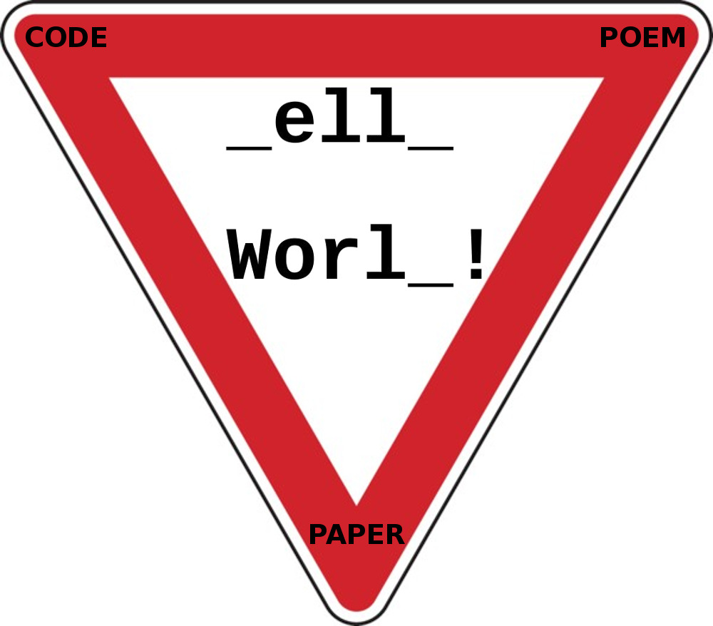
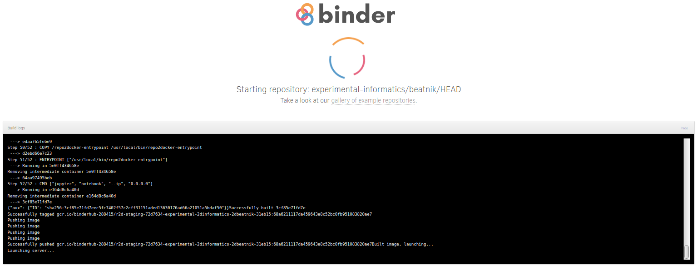
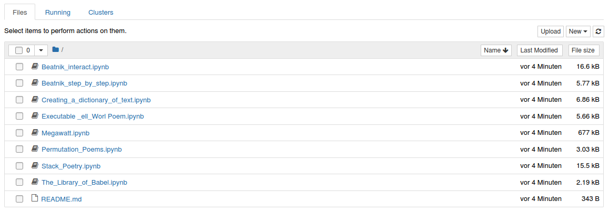

# The rule becomes the author!

»_ell_ Worl_!« is a text by us because we selected and recomposed the text sources. »_ell_ Worl_!« is a text by the authors who wrote the underlying texts. »_ell_ Worl_!« is a text by the Beatnik programmers, because we reassembled the text fragments based on their setup. »_ell_ Worl_!« is a text by Brian Kernighan because he wrote Hello World! for the first time in a programming tutorial. »_ell_ Worl_!« is a text by the students who were assigned the letters H, o and d but did not deliver. »_ell_ Worl_!« is a text.

<a href="https://pypi.org/project/beatnik/">Python package</a> @ PyPI &nbsp&nbsp&nbsp&nbsp&nbsp&nbsp&nbsp&nbsp&nbsp&nbsp&nbsp&nbsp&nbsp&nbsp&nbsp&nbspPublished in Anthology <a href="https://www.khm.de/kurze/">»KURZE04«</a>

This is the code repository to the executable artistic research paper [The rule becomes the author!](https://dev.ground-zero.khm.de/ell-worl-paper/) about the collective Beatnik poem *»\_ell\_ Worl\_!«*, published in July 2021 in the [KURZE04 Anthology](https://www.khm.de/kurze/), and about it’s [Interpreter](https://pypi.org/project/beatnik/), written by Ting Chun Liu. All of the 3 parts were developed and created together at [ground zero](https://ground-zero.khm.de/), in the context of the Seminar [Codichte – Experiments with Cognitive Systems](https://ground-zero.khm.de/?portfolio=seminar-codichte-experiments-with-cognitive-systems), given at the [Academy of Media Arts Cologne](https://en.khm.de/home/) in Winter 2020/21.

“*Executable*” *paper* means, that all the code in the paper was executed to produce this paper and can be executed as well. 

--------------------
To read how to expand the code and play with it, please click the button below and you will be directed to Binder:  

---------------------

## How to code in Binder?

[Binder](https://jupyter.org/binder), like other interactive computing products and services f.ex. [JupyterHub](https://jupyterhub.readthedocs.io/en/latest/), [JupyterLab](https://jupyterlab.readthedocs.io/en/stable/) or [Jupyter Notebook](https://jupyter-notebook.readthedocs.io/en/stable/) and [Jupyter{Book}](https://jupyterbook.org/intro.html) (the tools we have used to write and code this research paper) is part of the [Jupyter Project](https://jupyter.readthedocs.io/en/latest/), a nonprofit organization created to “*develop open-source software, open-standards, and services for interactive computing across different programming languages*” (Python, R, Julia).

*Binder* is meant for interactive and ephemeral interactive coding.

After you have clicked on the Binder-button on the upper right, the virtual environment in which you can code will be loaded into your browser. This will take around 1 minute:

After the environment is ready to use you can go into folder structure:

